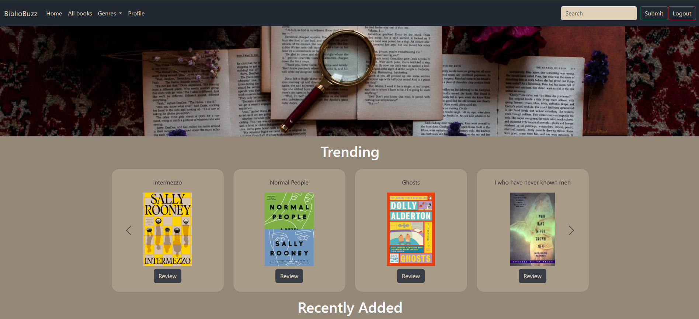

# 📚 Bibliobuzz – A Book Review Website  

Bibliobuzz is a dynamic web application designed for book lovers to share, explore, and read reviews of their favorite books.  
It provides a simple, user-friendly platform where users can browse books, write reviews, and discover what others are reading.

---

## ✨ Key Features
- **User Authentication**: Secure login and registration system with Django authentication.  
- **Book Listings**: Browse books, view details, and read reviews. Also can like and comment on other's reviews.  
- **Review System**: Users can post, edit, and delete their own reviews.  
- **Search Functionality**: Find books by title, author, or genre.  
- **Responsive Design**: Clean and simple UI built with HTML, CSS, and JavaScript.  

---

## 🚀 Technologies Used

| Purpose      | Technologies              |
|-------------|--------------------------|
| Frontend    | HTML, CSS, JavaScript     |
| Backend     | Django (Python)           |
| Database    | SQLite                   |

---

## 🖼️ Snapshots of the Project
### 🏠 Home Page

---
### ✍️ Fiction books Page

---
### 📖 Book Review Page

---
### ✍️ Edit Profile Page

---
### 😁Profile Page

## ⚙️ Setup Instructions

### ✅ Prerequisites
- Python 3.x installed  
- `pip` installed  
- A virtual environment tool (recommended)  

---

###  Steps to Run the Project

1. **Clone the Repository**

      git clone https://github.com/your-username/Bibliobuzz.git
      cd Bibliobuzz

2. **Create a Virtual Environment**

      (Optional but Recommended)
      On Windows:

      python -m venv venv
      venv\Scripts\activate

      On macOS/Linux:

      python3 -m venv venv
      source venv/bin/activate

3. **Install Dependencies**

      pip install -r requirements.txt

4. **Apply Migrations**

      python manage.py makemigrations 
      python manage.py migrate

5. **Create Superuser (Optional – for Admin Access)**

      python manage.py createsuperuser

6. **Run the Development Server**

      python manage.py runserver

7. **Access the Application**

      Open your browser and go to:
      http://127.0.0.1:8000/